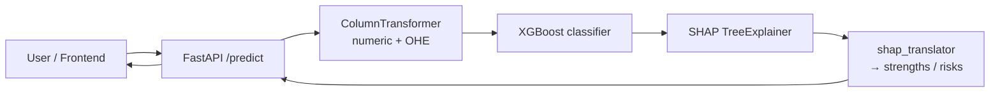

# VenturePulse

Predict whether a startup will **survive or shut down** from its funding history — and explain *why*.

VenturePulse trains an XGBoost classifier on Crunchbase venture-funding data, serves predictions through a FastAPI endpoint, and turns the model's SHAP values into plain-English "strengths" and "risks" that a frontend can show directly to a user.

Built as the final project for the Le Wagon Data Science & AI bootcamp.

🚀 **Live demo:** https://startupventurepulse.lovable.app/

---

## What it does

Given a company's funding profile (dates, amounts, funding types, region, industry), the API returns:

```jsonc
{
  "prediction": "survived",          // or "closed"
  "confidence": 92.4,                // % confidence in that prediction
  "survival_probability": 92.4,      // % probability of survival (always)
  "strengths": [                     // factors pushing toward survival
    { "label": "Active funding momentum", "impact": "high" },
    { "label": "Total capital raised",    "impact": "medium" }
  ],
  "risks": [                         // factors pushing toward closure
    { "label": "Long gaps between funding rounds", "impact": "low" }
  ]
}
```

Under the hood:

- **Model** — a scikit-learn `Pipeline` (`prep` ColumnTransformer + XGBoost classifier) saved to `models/best_pipeline_bin_death_score.pkl`.
- **Data** — the Kaggle Crunchbase "investments_VC" dataset, enriched with up-to-date operating status from the HuggingFace `opensporks/crunchbase` dataset (Aug 2024 snapshot). See `raw_data/enrich_status.py`.
- **Explainability** — `shap.TreeExplainer` over the XGBoost model; `project_logic/shap_translator.py` converts raw log-odds SHAP values into human-readable labels and impact levels.

---

## Results

| Metric | Value |
|---|---|
| ROC AUC (test set) | **0.870** |
| F1 — macro | 0.824 |
| F1 — closed class | 0.820 |

Binary classifier (survived vs closed) trained on ~43k Crunchbase companies
with enriched operating status. XGBoost (`max_depth=4`, `n_estimators=100`,
`learning_rate=0.05`) was selected over Random Forest for production due to
faster inference and direct SHAP support.

## Architecture



---

## Repository layout

```
.
├── fast_api/
│   └── app.py                 # FastAPI app: GET / (health), GET /predict
├── project_logic/
│   ├── registry.py            # save/load the trained pipeline (models/*.pkl)
│   ├── predict.py             # thin predict_proba wrapper
│   └── shap_translator.py     # SHAP values -> {strengths, risks} JSON
├── raw_data/
│   └── enrich_status.py       # enrich investments_VC.csv with HF status data
├── models/                    # trained pipeline artifact(s)  (git-ignored)
├── notebooks/                 # data cleaning, EDA, feature engineering, modeling, SHAP
├── Dockerfile
├── Makefile
├── requirements.txt
├── setup.py
└── .env_sample
```

> **Note:** `models/`, `raw_data/` and most data files are git-ignored. You need the trained
> `best_pipeline_bin_death_score.pkl` in `models/` before the API will start — ask a maintainer
> for the artifact, or retrain it from the modeling notebooks.

---

## Getting started

Requires **Python 3.10**.

```bash
# 1. Create / activate a virtual environment (pyenv example)
pyenv virtualenv 3.10 venturepulse
pyenv local venturepulse

# 2. Install dependencies + the package (editable)
pip install -r requirements.txt
pip install -e .

# 3. Provide the trained model
#    Put best_pipeline_bin_death_score.pkl into ./models/

# 4. Run the API
make run_api          # uvicorn fast_api.app:app --reload --port 8080
```

Then open <http://localhost:8080/docs> for the interactive Swagger UI.

### Example request

```bash
curl "http://localhost:8080/predict?\
founded_at=2018-01-01&first_funding_at=2018-09-01&last_funding_at=2021-06-01&\
funding_total_usd=12000000&funding_rounds=3&\
seed=1&venture=1&debt_financing=0&angel=0&grant=0&private_equity=0&\
round_A=1&round_B=1&round_C=0&round_D=0&\
region_group=USA&industry_group=Software_Data"
```

`region_group` is one of: `USA`, `EU_UK`, `Canada`, `Australia`, `Asia`, `Rest_World`, `Rest_Americas`, `Unknown`.
`industry_group` is one of: `Health_Bio`, `Consumer_Internet`, `Software_Data`, `Energy`, `Education`, `Services`, `Real_World`, `Ecommerce`, `FinTech`, `Hardware_DeepTech`, `Unknown`, `Other`.

---

## Docker

```bash
make docker_build     # docker build -t venturepulse .
make docker_run       # docker run -p 8080:8080 venturepulse
```

The container reads `PORT` (defaults to `8080`).

## Deployment (Google Cloud Run)

```bash
make gcloud_build     # gcloud builds submit --tag gcr.io/<project>/venturepulse
make gcloud_deploy    # gcloud run deploy venturepulse ... --region europe-west1
```

> The GCP project id is currently hard-coded in the `Makefile` — update it for your own project.

---

## Data enrichment

To regenerate the enriched dataset from scratch:

```bash
pip install datasets pandas
python raw_data/enrich_status.py --input raw_data/investments_VC.csv \
                                 --output raw_data/enriched_investments.csv
```

This streams the ~66k-row HuggingFace Crunchbase dataset and adds a `status_enriched` column
(`operating` / `acquired` / `closed`) without touching the original `status` column. Expect 3–5 minutes.

---

## Notebooks

The `notebooks/` directory contains the exploratory and modeling work, roughly in this order:

| Stage | Notebooks |
|-------|-----------|
| Data cleaning | `data_cleaning_all.ipynb`, `data_cleaning_enriched.ipynb` |
| Exploration | `data_exploration_*.ipynb` |
| Feature engineering | `feature_engineering_enriched_dataset.ipynb`, `label_feature_engineering_cdp.ipynb` |
| Modeling | `basic_modeling_all.ipynb`, `death_score_model.ipynb`, `modeling_new_targets.ipynb`, `slim_feature_set_model.ipynb`, `final_models_.ipynb` |
| Explainability | `shap_explainability.ipynb` |

---

## My contributions

This was a three-person Le Wagon final project. My main areas of work:

- **Data cleaning and enrichment**
  ([`notebooks/data_cleaning_all.ipynb`](notebooks/data_cleaning_all.ipynb),
  [`notebooks/data_cleaning_enriched.ipynb`](notebooks/data_cleaning_enriched.ipynb),
  [`raw_data/enrich_status.py`](raw_data/enrich_status.py) —
  branch [`enriched-dataset-paul`](https://github.com/paulcrn/VenturePulse/tree/enriched-dataset-paul)).
  Large parts of the Crunchbase data cleaning pipeline, plus the HuggingFace
  enrichment script that streams the `opensporks/crunchbase` dataset and
  refreshes operating status with August 2024 data without overwriting the
  original `status` column.

- **Model exploration, tuning, and final selection**
  ([`notebooks/final_models_.ipynb`](notebooks/final_models_.ipynb),
  [`notebooks/shap_explainability.ipynb`](notebooks/shap_explainability.ipynb)).
  Iterated through baseline → grid-searched candidates (XGBoost, Random Forest)
  across two targets (`bin_death_score`, `bin_acq_vs_closed`), added permutation
  importance cross-validation, and selected the production XGBoost pipeline
  (AUC 0.870, F1 0.824).

- **SHAP-to-plain-English translation layer**
  ([`project_logic/shap_translator.py`](project_logic/shap_translator.py) —
  branch [`feat/shap-translator`](https://github.com/paulcrn/VenturePulse/tree/feat/shap-translator)).
  476 lines that turn raw XGBoost SHAP values (log-odds) into the
  frontend-ready "strengths" / "risks" JSON. Direction-aware labels
  (e.g. positive SHAP on `time_since_last_funding` → "Active funding
  momentum"; negative → "No recent funding activity"), OHE handling,
  binary-feature consistency checks against the raw input, and impact
  thresholds calibrated against the mean |SHAP| per feature.

- **Production feature fix**
  (branch [`fix/time-since-last-funding`](https://github.com/paulcrn/VenturePulse/tree/fix/time-since-last-funding)).
  Replaced the leaky `years_operating` feature with `time_since_last_funding`
  to make real post-2015 startups land in-distribution at serve time.

## Tech stack

FastAPI · Uvicorn · scikit-learn · XGBoost 1.7.6 · SHAP · pandas · Docker · Google Cloud Run

## Authors

Le Wagon Data Science & AI — final project team.
